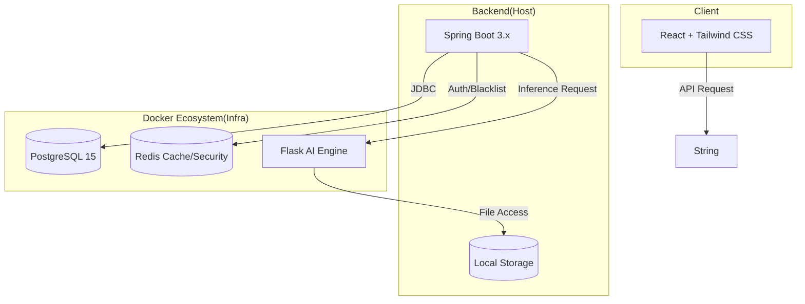

# 🪴 AI 식물 집사 블로그 #

**AI 모델을 활용한 식물 종류 판별 및 병애 진단 커뮤니티 플랫폼**


## 🏗️ 1. System Architecture ##



## 2.⚒️ Tech Stack
### 🔵 BackEnd & Security
-  JAVA 17 / Spring Boot 3.x
-  Spring Data JPA : Hibernate 기반 데이터 영속성 관리 및 Fetch Join을 통한 성능 최적화
-  Spring Security & JWT : Stateless 인증 체계 구축
-  Redis : JWT 블랙리스트 관리를 통한 보안 강화

### 🟣 AI/ ML Inference
- Python / Flask : 경량 추론 서버 운영
- YOLO v8/v11 : 식물 종류 및 병해 실시간 객체 탐지 모델 탑재

### 🟢 Frontend
 - React 18 : 컴포넌트 기반 UI 설계
 - Editor.js : 블록형 에디터를 통한 구조화된 콘텐츠 관리 및 이미지/글 자유 배치
 - Axios : 인터셉터를 활용한 JWT 자동 인증 및 전역 에러 핸들링

## 🌟 3. Key Features

### 🧩 블록 기반 게시글 에디터

단순 텍스트 방식을 탈피하여 글-사진-글 순서의 자유로운 배치를 지원합니다.

이미지 선행 업로드(Pre-upload) 방식을 통해 서버 자원을 효율적으로 관리합니다.

### 🔍 AI 식물 진단 & 도감 연동

업로드된 이미지를 분석하여 식물명과 병해명을 도출합니다.

도감 시스템(Dictionary): 단순 분석 결과를 넘어 DB에 저장된 증상, 해결책, 위험도를 매핑하여 전문적인 진단 보고서를 제공합니다.

### 🛡️ 강력한 세션 보안 및 최적화

Redis Blacklist: 로그아웃된 토큰의 재사용을 원천 차단하여 JWT의 보안 취약점을 보완했습니다.

Fetch Join & Distinct: JPA N+1 문제를 해결하여 대량 데이터 조회 시 성능을 최적화했습니다.

## 📖 4. Core API Specification ##


### 🔵 Backend API (Spring Boot)

#### 🌱 AI 분석 및 이미지 관리

| 분류 | 메서드 | 엔드포인트 | 설명 |  권한|
| ------------ |--------------- | ------------------------------------------| ----------------------------------------------------------------| -------- |
| **이미지 등록** | `POST` | `/api/posts/upload-image`| 이미지를 서버에 저장 | ✅ |
| **분석** | `POST`| `/api/posts/images/{image_id}/analyze`| Flask AI 분석 결과를 통해 DB에서 상세 식물/병해 정보를 가져옴 | ✅ |

#### 📝 게시글 및 커뮤니티

| 분류 | 메서드 | 엔드포인트 | 설명 |  권한|
| --------- |--------------- | ------------------------------------------| ------------------------------------------------------| -------- |
| **전체 피드 조회** | `GET` | `/api/posts`| 모든 사용자의 게시글을 최신 순으로 조회 | ✅ |
| **게시글 작성** | `POST`| `/api/posts`| Editor.js의 구조화 된 본문을 포함하여 게시글 저장 | ✅ |
| **게시글 상세** | `GET`| `/api/posts/{post_id}`| 특정 게시글의 분문과 분석된 이미지 정보를 조회 | ✅ |

#### 👤 사용자 및 소셜

| 분류 | 메서드 | 엔드포인트 | 설명 |  권한|
| --------- |--------------- | ------------------------------------------| ------------------------------------------------------| -------- |
| **로그인** | `POST` | `/api/auth/login`| 모든 사용자의 게시글을 최신 순으로 조회 | ❌ |
| **마이페이지** | `POST`| `/api/members/{member_id}/mypage`| 사용자의 팔로워/팔로잉 수와 작성글 목록을 조회 | ✅ |
| **팔로우** | `POST`| `/api/members/{member_id}/follow`| 다른 사용자를 팔로우 | ✅ |
| **내 정보 설정** | `GET`| `/api/members/me` | 내 정보를 수정/설정 | ✅ |


### 🟣 AI Inference API (Flask)
| 분류 | 메서드 | 엔드포인트 | 입력 데이터 | 반환 데이터 |
| ------------ |--------------- | ------------------------------------------| -----------------------------------------| ----------------------------------- |
| **객체 탐지** | `POST` | `/detect`| `mulipart/form-data`(image) | `JSON` (status, filename, results) |

```
{
    "status": "success",
    "filename": filename,
    "results": {
                "plant_detection" : [ {
                      "label" : "PeaceLily",
                      "confidence" : 0.72
                    } ],
                 "disease_analysis" : [ {
                      "label" : "curling",
                      "confidence" : 0.78
                      } ]
            }

        }
```


## 🚀 5. Getting Started


**Prerequisites**

- Docker & Docker Compose

- JDK 17

- Node.js & npm


**Installation & Run**

```
# 1. 인프라 실행 (DB, Redis, Flask, React)
docker-compose up -d

# 2. 백엔드 실행
cd backend_core
./gradlew bootRun

```

